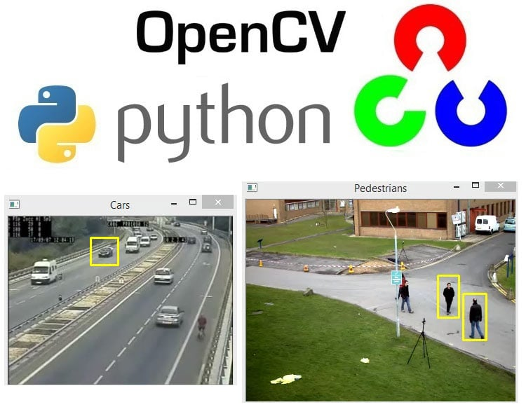

# 🧠Real-time object detection + AI visual descriptor

## 📸 Demo


## 📝 Overview
1) This project uses YOLOv8, Ollama Vision Models (LLaVA), and Llama3.2 to analyze objects in real-time using your webcam.
2) It provides:
- Object detection
- Visual description of the detected object
- Nutrition facts (when applicable)

## ⚙️ How It Works
- YOLOv8 detects objects in the camera frame
- The selected object is cropped
- Crop is sent to LLaVA → Generates visual description
- Object name is sent to Llama3.2 → Provides nutrition info
- Combined results are displayed in a UI panel

## ✨ Features
- 🔍 Real-time YOLOv8 object detection
- 🎨 Vision AI (LLaVA) image descriptions
-  🍏 Llama Text AI nutrition summarization
- 🎥 Live webcam interface
- ⬆️⬇️ Select among detected objects
- ⎵ Press SPACE for 2-step AI analysis
- 🖼️ On-screen UI overlay

## 📦 Requirements
1) Install using pip:
- pip install ultralytics opencv-python pillow requests numpy

2) Ollama Setup
- Install Ollama:
- https://ollama.ai

3) Pull required models:
- ollama pull llava
- ollama pull llama3.2

4) ▶️ Running the Program
- python src/Object_detection.py

5) 🎮 Controls
- SPACE	AI analysis (description + nutrition)
- ↑ / ↓	Change selected object
- Q	Quit

6) 📁 Project Structure
<pre> ``` project/ ├─ src/ │ └─ Object_detection.py ├─ images/ │ └─ demo.png ├─ README.md └─ requirements.txt ``` </pre>
